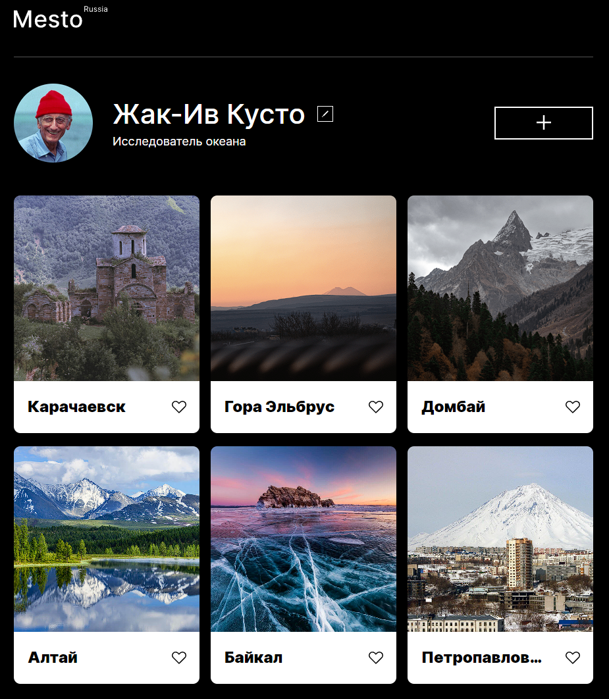

## **Сontent**

1. Description
2. Resources
3. Functionality
4. Technologies used
5. Link to GitHub Pages

**Description**

There will be a project about places of Russia presented by cards.
Website will look responsive on the most common screen resolutions.
You can edit your profile. Delete card or add new one. Like button will work aswell.

**Resources**

- [Link to layout in Figma](https://www.figma.com/file/2cn9N9jSkmxD84oJik7xL7/JavaScript.-Sprint-4?node-id=0-1)

**Functionality**

- organazing file structure according to BEM-methodology (Nested method),
- flexbox-layouting, positioning elements,
- animating and transforming page elements with CSS,
- added the ability to edit and add data with Javascript

**Technologies used**

- HTML
- CSS
- Import style rules and fonts from stylesheets
- Figma
- Git
- Javascript
- React

## [Check out the project on GitHubPages](https://freddymutant.github.io/mesto/)
